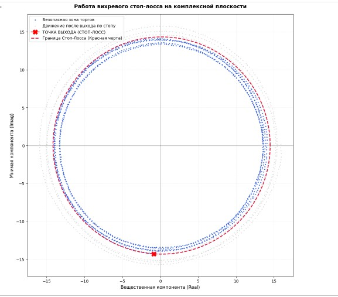

# 📈 Fixed-Income Quantum Analytics: OFZ Yield Curve Forward Matrices & Complex Phase Vortices

A professional Python-based financial engineering project focused on the **implied forward yield-to-maturity (YTM) modeling** of Russian Government Bonds (OFZ) using a coupon-bearing **Discrete DCF approach**, coupled with **Complex Analysis (Complex Variables)** and **Discrete Fourier Transforms (FFT)** to map market cycles and execute adaptive risk management.

---

## 🚀 Key Features

* **Discrete Coupon DCF Forward Matrix:** Calculates exact implied forward YTMs ("break-even rates") using semi-annual coupon profiles, matching the official **Moscow Exchange (MOEX)** calculation standards.
* **Complex Phase-Space Vectorization:** Translates continuous yield curves into polar complex coordinates \(Z(t) = R(t) \cdot e^{i \cdot \phi(t)}\), encoding YTM amplitude as the modulus and macroeconomic time lags as the argument (phase).
* **Fourier Harmonic Analysis (FFT):** Decomposes continuous interest rate fluctuations into a frequency spectrum to separate dominant structural institutional trends from daily liquidity noise.
* **Stochastic Vortex Simulation:** Models interest rate dynamics as an attractor-driven stochastic wave process spinning in the complex plane (\(Re / Im\)).
* **Vortex Stop-Loss Algorithm:** A phase-space quantitative risk-filter that tracks Euclidean distance thresholds on the complex plane and deploys consecutive confirmation window triggers to exit positions dynamically at the early genesis of market panics.

---

## 📐 Mathematical Framework

### 1. Coupon-Bearing Yield-to-Maturity (DCF)
The actual market dirty price (\(P_{dirty}\)) of a coupon bond is mapped to its spot YTM via numerical optimization (Newton-Raphson method):

$$\[P_{dirty} = \sum_{k=1}^{n} \frac{CF_k}{\left(1 + \frac{YTM}{2}\right)^{2 \cdot t_k}}\]$$

### 2. Complex Vectorization
Individual bonds are mapped onto the complex plane to capture cyclical wave features:

\[Z_{bond} = \text{YTM}_{spot} \cdot \left(\cos(\phi) + i \cdot \sin(\phi)\right)\]

### 3. Phase-Space Trajectory Distance
Risk accumulation and macro-regime shifts are captured by tracking the trajectory variance from the steady-state vortex center (\(\mu_{Re}, \mu_{Im}\)):

\[\text{Distance} = \sqrt{(Re(Z) - \mu_{Re})^2 + (Im(Z) - \mu_{Im})^2}\]

---

## 📊 Visualizing the Complex Vortex

When a macroeconomic shock hits the fixed-income market (e.g., a sudden key rate hike by the central bank), the rate trajectory undergoes a spectacular geometric transformation:

1. **Steady State:** Rates spin closely inside a stable **complex torus (annular ring)** representing standard market mean-reversion noise.
2. **The Shock Event:** The equilibrium shifts instantly.
3. **The Spiral Transition:** The complex trajectory does not jump linearly; it accelerates outward in a **spiral vortex** until it stabilizes on a wider outer orbit (higher interest rate regime).

---

## 🛠️ Tech Stack & Dependencies

* **Python 3.8+**
* `numpy` — for vectorized matrix algebra and FFT execution.
* `pandas` — for clean matrix generation and formatting.
* `scipy` — specifically `scipy.optimize.newton` for high-precision root finding.
* `matplotlib` — for rendering 2D complex phase portraits and date-formatted charts.

---

## 💡 Practical Takeaways for Investors

* **Break-Even Matrices:** Use the generated forward matrix to decide whether to lock in long-term yields immediately or park capital in short-term floaters/bonds and execute a roll-over strategy.
* **Smart Stop-Loss:** Replace rigid, price-only stop orders with **Vortex Stops** that ignore extreme but purely cyclical trading noise while acting as an early panic indicator during structural regime shifts.

---
*Created for personal quantitative research, financial modeling exploration, and mathematical refinement.* 🧠⚙️

